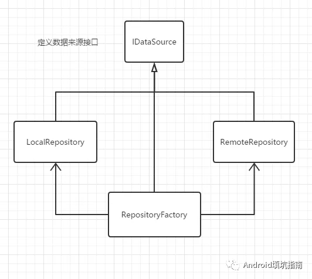
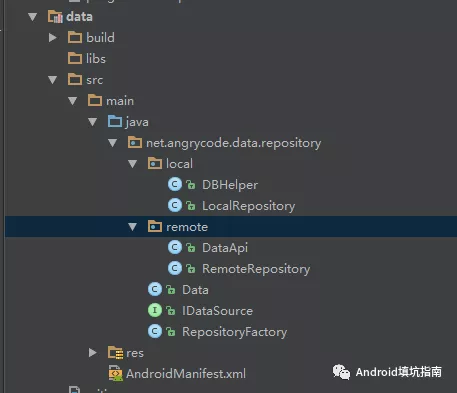

### 0x00 什么是 Repository 模式

Repository 这个词直译过来仓库、仓储的意思。这个意思其实也能反应出 Repository 模式作用。App 开发中少不了对数据的操作，数据的来源可能有很多种：网络、数据库、文件以及内存中的缓存。而 Repository 就相当于一个仓库管理员，管理这些数据的存储。当**业务层**想要获取或者存储数据时，只需要通过 Repository 的管理员进行操作。这样的好处就是：**屏蔽数据来源的操作接口。**对于业务层来说不必关心数据存在哪里，以及如何存储的。而且也符合我们**组件化/模块化架构设计的思想。**即当我们更换数据存储设备时，例如从 Android 系统 Sqlite 数据转换为第三方的数据库时，不会影响到业务逻辑。

### 0x01 设计模式

首先预览一下 Repository 模式的设计类图（欢迎拍砖）



`IDataSource` 是定义了数据来源接口，是根据具体的业务需要定义。一般来说，有**增、删、改、查**这几个方法。

`LocalRepository` 封装的是本地存储方式，实现 `IDataSource` 接口。

`RemoteRepository` 封装的是网络存储方式，实现 `IDataSource` 接口。

其中 `LocalRepository` 与 `RemoteRepository` 就是代表着各种存储方式的具体实现。而 `RepositoryFactory` 就是传说中的“仓库管理员”，管理着各种存储方式，它也是**业务层**与**数据层**交互的桥梁。

###  0x02 Show me the code

假设目前有个业务是获取远程数据的需求，如果本地有缓存数据则从本地获取，否则从网络中获取。这样的业务逻辑很常见，我们用 Repository

 模式进行封装。

首先预览代码总体结构



#### IDataSource

```java
public interface IDataSource<T> {
    void add(T t);

    void delete(T t);

    void update(T t);

    List<T> queryAll();

    T queryById(int id);
}
```

#### LocalRepository

```java
public class LocalRepository implements IDataSource<Data> {

    public LocalRepository() {
    }

    @Override
    public void add(Data data) {
        DBHelper.get().add(data);
    }

    @Override
    public void delete(Data data) {
        DBHelper.get().delete(data);
    }

    @Override
    public void update(Data data) {
        DBHelper.get().update(data);
    }

    @Override
    public List<Data> queryAll() {
        return DBHelper.get().queryAll();
    }

    @Override
    public Data queryById(int id) {
        return DBHelper.get().queryById(id);
    }
}
```

#### RemoteRepository

```java
public class RemoteRepository implements IDataSource<Data> {
    @Override
    public void add(Data data) {
        DataApi.get().add(data);
    }

    @Override
    public void delete(Data data) {
        DataApi.get().delete(data);
    }

    @Override
    public void update(Data data) {
        DataApi.get().update(data);
    }

    @Override
    public List<Data> queryAll() {
        return DataApi.get().queryAll();
    }

    @Override
    public Data queryById(int id) {
        return DataApi.get().queryById(id);
    }
}
```

#### RepositoryFactory

```java
public class RepositoryFactory implements IDataSource<Data> {
    private IDataSource<Data> local;
    private IDataSource<Data> remote;

    private static RepositoryFactory INSTANCE;
    /**
     * 使用Map实现一个内存缓存
     */
    HashMap<String, Data> mCache = new HashMap<>();

    private RepositoryFactory(@NonNull IDataSource<Data> local, @NonNull IDataSource<Data> remote) {
        this.local = local;
        this.remote = remote;
    }

    public static RepositoryFactory get(@NonNull IDataSource<Data> local, @NonNull IDataSource<Data> remote) {
        if (INSTANCE == null) {
            INSTANCE = new RepositoryFactory(local, remote);
        }
        return INSTANCE;
    }

    public static RepositoryFactory get() {
        if (INSTANCE == null) {
            INSTANCE = new RepositoryFactory(new LocalRepository(), new RemoteRepository());
        }
        return INSTANCE;
    }

    public void destory() {
        INSTANCE = null;
    }

    @Override
    public void add(Data data) {
        local.add(data);
        remote.add(data);
        mCache.put(String.valueOf(data.id), data);
    }

    @Override
    public void delete(Data data) {
        local.delete(data);
        remote.delete(data);
        mCache.remove(String.valueOf(data.id));
    }

    @Override
    public void update(Data data) {
        local.update(data);
        remote.update(data);
        mCache.put(String.valueOf(data.id), data);
    }

    /**
     * @return
     */
    @Override
    public List<Data> queryAll() {
        List<Data> list = local.queryAll();
        if (list.isEmpty()) {
            list = remote.queryAll();
        }
        return list;
    }

    /**
     * 这里使用三级缓存获取一个Data对象
     *
     * @param id
     * @return
     */
    @Override
    public Data queryById(int id) {

        Data data = mCache.get(String.valueOf(id));
        if (data == null) {
            data = local.queryById(id);
        }
        if (data == null) {
            data = remote.queryById(id);
        }
        if (data != null) {
            mCache.put(String.valueOf(id), data);
        }
        return data;
    }

}
```

#### 使用示例

```java
Flowable.fromCallable(new Callable<List<Data>>() {
            @Override
            public List<Data> call() throws Exception {
                List<Data> dataList = RepositoryFactory.get().queryAll();
                return dataList;
            }
        }).observeOn(AndroidSchedulers.mainThread())
                .subscribeOn(Schedulers.io())
                .subscribe(new Consumer<List<Data>>() {
                    @Override
                    public void accept(@NonNull List<Data> datas) throws Exception {
                        textView.setText("data size:" + datas.size());
                    }
                }, new Consumer<Throwable>() {
                    @Override
                    public void accept(@NonNull Throwable throwable) throws Exception {
                        textView.setText(throwable.getMessage());
                    }
                });
```

这里是直接使用了 RxJava2 进行调用，因为 Repository 是对数据的请求和访问，这个是耗时操作，故需要放在后台线程中进行。在实际的项目中一般都会使用 MVP 来封装这一层。


本文Demo ：[wecodexyz/Componentization][4]

参考文献：[googlesamples/android-architecture][2]


[1]:http://angrycode.qiniudn.com/Repository.PNG	"Repository 模式"
[2]:https://github.com/googlesamples/android-architecture	"android-architecture"
[3]:http://angrycode.qiniudn.com/repository_code_structure.PNG	"repository-code-structure"
[4]:https://github.com/wecodexyz/Componentization	"wecodexyz/Componentization"