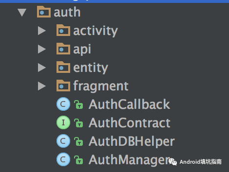
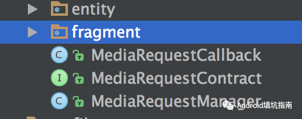

在不久之前分享一篇[《App 组件化/模块化之路——如何封装网络请求框架》](https://mp.weixin.qq.com/s/JBcx9qn3e9A9fGiMxuxH4Q)文章介绍了我在项目中封装网络请求框架的思路。开发一个 App 会涉及到很多网络请求 API ，例如登录注册接口、用户信息接口、业务列表请求接口等等。而本文介绍的是如何模块化设计这些接口，使得项目中更好地复用代码。当然这仅仅是一家之言，欢迎留言拍砖。

### 0x00 问题

网络请求中最常见的莫过于**用户授权登录模块**了。现在以此模块为例，大概有以下接口

- 登录 sign_in
- 注册 sign_up
- 找回密码 find_password
- 获取短信验证码 get_validate_code
- 获取用户信息 user_info
- 修改用户信息 edit_user
- 绑定手机号 bind_phone

假设一个 App 中有这些接口，那么如何设计这些接口呢？按照我们之前设计的网络请求框架就是把每一个具体的 API (例如登录接口) 写一个 Request 类。

```java
public class SignInRequest extends BaseTextRequest<SignInResult> {

    public SimpleTextRequest(Context context, Map<String, String> params) {
        super(context);
        addParams(params);
    }

    @Override
    public String getUrl() {
        return "https://api.angrycode.net/signin";
    }

    @Override
    public HttpMethod getHttpMethod() {
        return HttpMethod.POST;
    }

    @Override
    protected SignInResult onRequestFinish(String result) {
        return SignInResult.parse(result);
    }

    @Override
    protected SignInResult onRequestError(int code, String message) {
        return new SignInResult(code,message);
    }
}
```

类似的注册接口对应一个 SignUpRequest 类，于是这样有多少个接口就又多少个 Request 类。

如果你的 App 业务比较复杂，那么 Request 类数目就会暴增，这时候如何组织管理这些 Request 类就是一个问题了。

### 0x01 接口模块化

思路其实也简单。不错，为了让你的接口更好的复用，我们把整个模块相关的接口进行整体设计。对外统一接口和回调方法。我们来看代码。

#### AuthContract

```java

/**
 * Created by wecodexyz@gmail.com on 2017/10/14 下午5:57.
 * GitHub - https://github.com/wecodexyz
 * Description:
 */

public interface AuthContract {
   
    interface Presenter {
        /**
         * 登录：/api/1.0/user/sign/in
         *
         * @param account  手机或邮箱
         * @param password 登录密码
         * @param type     类型：0-普通登录、1-邮箱登录、2-手机登录
         */
        void signIn(String account, String password, @SignInType int type);

        /**
         * 注册：/api/1.0/user/sign/up
         
         * @param nick_name 用户昵称 optional
         * @param signature 用户签名 optional
         */
        void signUp(String account, String password, @SignInType int type, String code, String nick_name, String signature);
        /**
         * 登出：/api/1.0/user/sign/out
         */
        void signOut();
        /**
         * 修改密码：/api/1.0/user/password/update
         *
         * @param old_password 原密码
         * @param new_password 新密码
         */
        void updatePassword(String old_password, String new_password);
        /**
         * 手机绑定：/api/1.0/user/phone/bind
         */
        void bindPhone(String phone, String code, String password);
        /**
         * 手机解绑：/api/1.0/user/phone/unbind
         */
        void unbindPhone(String phone, String code);
        /**
         * 获取个人资料：/api/1.0/user/profile
         */
        void profile();
        
    }

    interface View {
        /**
         * 注册结果
         *
         * @param signInResult
         */
        void onSignUpFinish(SignInResult signInResult);
        /**
         * 登录结果
         *
         * @param signInResult
         */
        void onSignInFinish(SignInResult signInResult);
        /**
         * 手机绑定结果
         *
         * @param result
         */
        void onBindPhoneFinish(APIResult result);
        /**
         * 获取个人资料
         *
         * @param result
         */
        void onRequestProfileFinish(ProfileResult result);
        /**
         * 获取个人资料
         *
         * @param result 更新结果
         */
        void onUpdateProfileFinish(APIResult result);
        /**
         * 出错回调
         *
         * @param code
         * @param msg
         */
        void onError(int code, String msg);
      
      	void onFinish();
      
      	void onBegin();

    }

}
```

首先，根据 API 设计 Contract 接口，在这里定义接口请求方法和回调方法。例如我们这个登录模块，就可以定义一个 `AuthContract` 协议接口，在这个`Contract`里面又管理着 `Presenter` 和 `View` 接口，分别代表具体 API 请求方法和数据回调方法。其中在 `View` 接口中定义了几个通用的回调`onBegin`,`onFinish `,`onError`,分别代表请求开始、结束、出错等几种状态，其它方法就是具体 API 返回的数据回调了。

这个 `Contract` 接口设计思路是源于[googlesamples/android-architecture](https://github.com/googlesamples/android-architecture/blob/todo-mvp-clean/todoapp/app/src/main/java/com/example/android/architecture/blueprints/todoapp/tasks/TasksContract.java) 。这样的好处我认为就是很好的管理这个模块中的众多的接口和回调方法，而维护者一看就一目了然，非常清晰。

然后，实现一个 `Contract` 接口中的 `View` 接口。其实是空实现。

#### AuthCallback

```java

/**
 * Created by wecodexyz@gmail.com on 2017/10/14 下午6:53.
 * GitHub - https://github.com/wecodexyz
 * Description: 授权登录以及用户相关接口回调类
 */

public class AuthCallback implements AuthContract.View {
    @Override
    public void onSignUpFinish(SignInResult signInResult) {

    }

    @Override
    public void onSignInFinish(SignInResult signInResult) {

    }

    @Override
    public void onSignOutFinish(APIResult result) {

    }

    @Override
    public void onUpdatePasswordFinish(APIResult result) {

    }

    @Override
    public void onBindPhoneFinish(APIResult result) {

    }

    @Override
    public void onUnbindPhoneFinish(APIResult result) {

    }

    @Override
    public void onRequestProfileFinish(ProfileResult result) {

    }

    @Override
    public void onUpdateProfileFinish(APIResult result) {

    }

    @Override
    public void onError(int code, String msg) {

    }
  	
  	@Override
  	public void onFinish(){
        
    }
  	
  	@Override
  	public void onBegin(){
        
    }
}
```

为什么要提供一个空实现的类呢？其实为了方便使用。想想你使用过的`WebViewChrome` 的接口回调。

最后，我们实现 `Contract` 中的 `Presenter` 接口了。这个就是我们这个模块化接口的核心类了。

#### AuthManager

```java
/**
 * Created by wecodexyz@gmail.com on 2017/10/14 下午6:55.
 * GitHub - https://github.com/wecodexyz
 * Description:
 */

public class AuthManager implements AuthContract.Presenter {

    private Context mContext;

    private List<AuthCallback> mAuthCallbacks;

    private SignInResult mSignInResult;

    private AuthDBHelper mAuthDBHelper;

    private AuthManager() {
    }

    private static class Holder {
        private static final AuthManager INSTANCE = new AuthManager();
    }

    public static AuthManager get() {
        return Holder.INSTANCE;
    }

    /**
     * 在Application中进行初始化
     *
     * @param context application context
     */
    public void init(Context context) {
        mContext = context.getApplicationContext();
        //获取本地登录信息
        mAuthDBHelper = new AuthDBHelper(mContext);

        mSignInResult = mAuthDBHelper.loadSignInFromCache();
    }

    /**
     * 是否已登录授权
     *
     * @return
     */
    public boolean isAuth() {
        return mSignInResult != null && mSignInResult.isStatus();
    }
    public void registerCallback(AuthCallback authCallback) {
        if (mAuthCallbacks == null) {
            mAuthCallbacks = new ArrayList<>();
        }
        mAuthCallbacks.add(authCallback);
    }

    public void unregisterCallback(AuthCallback authCallback) {
        mAuthCallbacks.remove(authCallback);
    }

    public void clearCallbacks() {
        if (mAuthCallbacks == null) {
            return;
        }
        mAuthCallbacks.clear();
    }
    @Override
    public void signIn(String account, String password, @AuthContract.SignInType int type) {
        HashMap<String, String> params = new HashMap<>();
        if (!TextUtils.isEmpty(account)) {
            params.put("account", account);
        }
        if (!TextUtils.isEmpty(password)) {
            params.put("password", password);
        }
        params.put("type", String.valueOf(type));

        SignInRequest request = new SignInRequest(mContext);
        request.addParams(params);
        request.request()
                .observeOn(AndroidSchedulers.mainThread())
                .subscribeOn(Schedulers.io())
          		.doOnSubscribe(new Consumer<Subscription>() {
                    @Override
                    public void accept(@NonNull Subscription subscription) throws Exception {
                        for (AuthCallback callback : mCallbacks) {
                            callback.onBegin();
                        }
                    }
                })
                .doFinally(new Action() {
                    @Override
                    public void run() throws Exception {
                        for (AuthCallback callback : mCallbacks) {
                            callback.onFinish();
                        }
                    }
                })
                .doAfterNext(new Consumer<SignInResult>() {
                    @Override
                    public void accept(@NonNull SignInResult signInResult) throws Exception {
                        mAuthDBHelper.cacheSignIn(signInResult);
                    }
                })
                .subscribe(new Consumer<SignInResult>() {
                    @Override
                    public void accept(@NonNull SignInResult signInResult) throws Exception {
                        if (signInResult.isStatus()) {
                            mSignInResult = signInResult;
                            UserInfo.fromSigninResult(mSignInResult);
                        }
                        for (AuthCallback callback : mAuthCallbacks) {
                            callback.onSignInFinish(signInResult);
                        }
                    }
                }, new Consumer<Throwable>() {
                    @Override
                    public void accept(@NonNull Throwable throwable) throws Exception {
                        LogUtils.e("sign in error -> " + throwable);
                        callbackError(110, "sign in error");
                    }
                });
    }
    //接口太多这里只列举signup接口，其中接口类似...

}
```

`AuthManager` 这个类设计单例模式。除了具体 API 实现接口还有以下几个方法

- init 全局初始化方法。主要是为了保存 Application 上下文，因为接口请求会使用到。
- registerCallback 注册回调。哪里使用，就哪里注册
- unregisterCallback 取消注册回调。与上面方法对应使用，避免页面内存泄露
- clearCallbacks 清除所有回调。

具体的 API 实现中，我这里就使用了之前网络框架中的代码 SignInRequest。

在 `AuthManager` 中还有一个 `AuthDBHelper` 类，这个是用户信息的缓存类。只要用户登录过了，那么下次就是直接取缓存中的登录信息就可以了。

### 0x02 整体结构

预览以下整体的结构



与用户相关的API都放在此模块中进行管理，而其它模块进行使用就很方便了。

首先，在Application中进行初始化

```java
	@Override
    public void onCreate() {
        super.onCreate();
        AuthManager.get().init(this);
    }
```

这个用法是不是与其它第三方 SDK 的使用类似呢？可以感受一下，其实这个也是之前提到的 SDK 设计思路。

然后在需要调用接口的页面中，如LoginFragment

```java
	AuthCallback mAuthCallback = new AuthCallback() {
        @Override
        public void onError(int code, String msg) {
            //请求出错
        }
      
      	@Override
      	public void onBegin(){
            //请求开始
        }
	
      	@Override
      	public void onFinish(){
            //请求结束
        }
      
        @Override
        public void onSignInFinish(SignInResult signInResult) {
            super.onSignInFinish(signInResult);
            if (signInResult.isStatus()) {
                //登录成功
            }
        }
    };
	@Override
    public void onActivityCreated(Bundle savedInstanceState) {
        super.onActivityCreated(savedInstanceState);
        AuthManager.get().registerCallback(mAuthCallback);
    }
	@Override
    public void onDestroyView() {
        super.onDestroyView();
        AuthManager.get().unregisterCallback(mAuthCallback);
    }
```

这样用起来是不是很方便呢？

目前在项中中除了 API 可以这样设计之外，还有其它一个功能只要各个模块都有可能经常使用到的都可以使用这样的思路。

例如，我的 App 里很多页面都会用到获取本地音乐或者视频的列表。同样地，有以下几个类。

