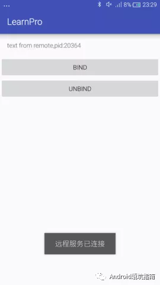
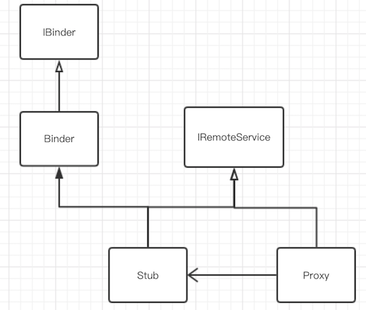
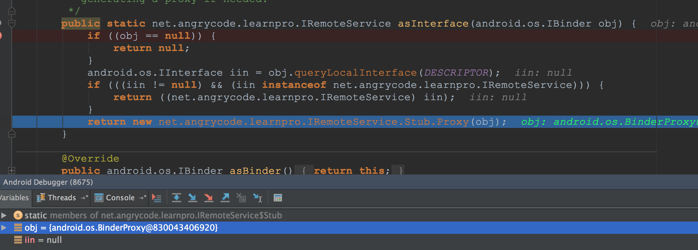
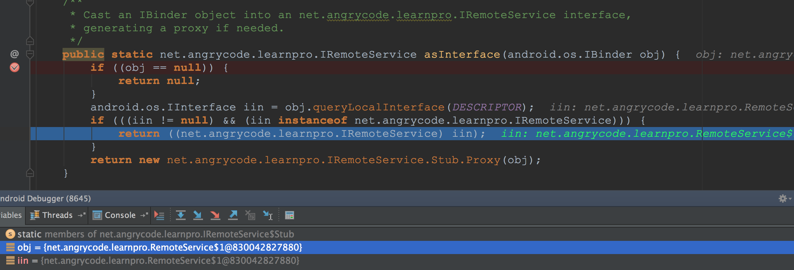

`Binder`通信是Android系统架构的基础。本文尝试从AIDL的使用开始理解系统的`Binder`通信。

### 0x00 一个AIDL的例子

首先我们创建一个项目，写一个`RemoteService.java`，并定义个`AIDL`接口`IRemoteService.aidl`

```java
interface IRemoteService {
    String getText();
}
```

这时候IDE会自动在目录`build/generated/source/aidl/debug/`生成`IRemoteService.java`文件。

本文为了方便调试和理解`AIDL`的过程，我们把生成的`IRemoteService.java`文件拷贝出来，放在`app/main/java`目录下，然后把`aidl`文件夹删除。

`RemoteService`为服务端，`MainActivity`为客户端。最后项目结构为


### 0x01 远程服务RemoteService

```java
public class RemoteService extends Service {
    public final static String ACTION = "net.angrycode.RemoteService";
    @Nullable
    @Override
    public IBinder onBind(Intent intent) {
        return mBinder;
    }
    /**
     * 定义远程服务对外接口
     */
    IRemoteService.Stub mBinder = new IRemoteService.Stub() {
        @Override
        public String getText() throws RemoteException {
            return "text from remote,pid:" + Process.myPid();
        }
    };
}
```

在`RemoteService`中定义`IBinder`接口，并在`onBind()`方法中返回，供客户端使用。

最后在`mainifest`文件中注册远程服务，指定进程为私有进程

```java
<service android:name=".RemoteService"
    android:process=":remote">
    <intent-filter>
        <action android:name="net.angrycode.RemoteService"/>
    </intent-filter>
</service>
```

### 0x02 本地客户端MainActivity

```java
public class MainActivity extends AppCompatActivity {
    private TextView mTextMessage;
    @Override
    protected void onCreate(Bundle savedInstanceState) {
        super.onCreate(savedInstanceState);
        setContentView(R.layout.activity_main);
        mTextMessage = (TextView) findViewById(R.id.message);
    }

    public void onClickBind(View view) {
        Intent service = new Intent(this, RemoteService.class);
        service.setAction(RemoteService.ACTION);
        bindService(service, conn, Context.BIND_AUTO_CREATE);
    }
    public void onClickUnBind(View view) {
        unbindService(conn);
    }
    ServiceConnection conn = new ServiceConnection() {
        @Override
        public void onServiceConnected(ComponentName name, IBinder service) {
            IRemoteService iRemoteService = IRemoteService.Stub.asInterface(service);
            try {//连接之后获取到远程服务text
                String text = iRemoteService.getText();
                mTextMessage.setText(text);
            } catch (RemoteException e) {
                e.printStackTrace();
            }
            Toast.makeText(getApplication(), "远程服务已连接", Toast.LENGTH_LONG).show();
        }
        @Override
        public void onServiceDisconnected(ComponentName name) {
            Toast.makeText(getApplication(), "远程服务已断开", Toast.LENGTH_LONG).show();
        }
    };
}
```

本地客户端实现了`ServiceConnection`接口，用于监听远程服务的连接状态，并在`onServiceConnected()`中拿到远程服务`RemoteService`对外的接口`IRemoteService`的引用。

当客户端进行绑定远程服务时，就使用`IRemoteService.Stub.asInterface(IBinder)`获取到远程服务对象，客户端与服务端的通信就开始了。



### 0x03 IRemoteService接口

系统自动生成的这个文件中有除了我们定义`getText()`方法外还生成了两个内部类`Stub`和`Proxy`。

```java
public interface IRemoteService extends android.os.IInterface {
    /**
     * Local-side IPC implementation stub class.
     */
    public static abstract class Stub extends Binder implements IRemoteService {
        private static final java.lang.String DESCRIPTOR = "net.angrycode.learnpro.IRemoteService";

        /**
         * Construct the stub at attach it to the interface.
         */
        public Stub() {
            this.attachInterface(this, DESCRIPTOR);
        }

        /**
         * Cast an IBinder object into an net.angrycode.learnpro.IRemoteService interface,
         * generating a proxy if needed.
         */
        public static IRemoteService asInterface(IBinder obj) {
            if ((obj == null)) {
                return null;
            }
            android.os.IInterface iin = obj.queryLocalInterface(DESCRIPTOR);
            if (((iin != null) && (iin instanceof IRemoteService))) {
                return ((IRemoteService) iin);
            }
            return new IRemoteService.Stub.Proxy(obj);
        }

        @Override
        public IBinder asBinder() {
            return this;
        }

        @Override
        public boolean onTransact(int code, Parcel data, Parcel reply, int flags) throws RemoteException {
            switch (code) {
                case INTERFACE_TRANSACTION: {
                    reply.writeString(DESCRIPTOR);
                    return true;
                }
                case TRANSACTION_getText: {
                    data.enforceInterface(DESCRIPTOR);
                    java.lang.String _result = this.getText();
                    reply.writeNoException();
                    reply.writeString(_result);
                    return true;
                }
            }
            return super.onTransact(code, data, reply, flags);
        }

        private static class Proxy implements IRemoteService {
            private IBinder mRemote;

            Proxy(android.os.IBinder remote) {
                mRemote = remote;
            }

            @Override
            public android.os.IBinder asBinder() {
                return mRemote;
            }

            public java.lang.String getInterfaceDescriptor() {
                return DESCRIPTOR;
            }

            @Override
            public java.lang.String getText() throws RemoteException {
                android.os.Parcel _data = android.os.Parcel.obtain();
                android.os.Parcel _reply = android.os.Parcel.obtain();
                java.lang.String _result;
                try {
                    _data.writeInterfaceToken(DESCRIPTOR);
                    mRemote.transact(Stub.TRANSACTION_getText, _data, _reply, 0);
                    _reply.readException();
                    _result = _reply.readString();
                } finally {
                    _reply.recycle();
                    _data.recycle();
                }
                return _result;
            }
        }

        static final int TRANSACTION_getText = (android.os.IBinder.FIRST_CALL_TRANSACTION + 0);
    }

    public java.lang.String getText() throws android.os.RemoteException;
}
```

`Stub`类继承于`Binder`，但它们都实现了`IRemoteService`接口。

`Binder`是何物呢？

> Base class for a remotable object, the core part of a lightweight remote procedure call mechanism defined by Binder.This class is an implementation of IBinder that provides standard local implementation of such an object.

可以看出`Binder`是一个远程对象，它实现了提供本地标准接口的`IBinder`。



**`Stub`类代表着远程服务，而`Proxy`代表着远程服务在本地的代理。**

### 0x04 获取Binder对象

在客户端`MainActivity`中，绑定远程服务之后，使用`IRemoteService.Stub.asInterface()`方法获取到远程服务的`Binder`对象。

```java
/**
 * Cast an IBinder object into an net.angrycode.learnpro.IRemoteService interface,
 * generating a proxy if needed.
 */
public static net.angrycode.learnpro.IRemoteService asInterface(android.os.IBinder obj) {
    if ((obj == null)) {
        return null;
    }
    android.os.IInterface iin = obj.queryLocalInterface(DESCRIPTOR);
    if (((iin != null) && (iin instanceof net.angrycode.learnpro.IRemoteService))) {
        return ((net.angrycode.learnpro.IRemoteService) iin);
    }
    return new net.angrycode.learnpro.IRemoteService.Stub.Proxy(obj);
}
```

这个方法先查找本地是否存在这个对象，存在则返回；不存在则返回一个`Proxy`对象。

通过定点调试，可以知道当`RemoteService`在子进程中时，`asInterface(obj)`参数是一个`BinderProxy`对象，这个是远程服务进程的代理类。这个时候返回给客户端的是`Proxy`对象。



**客户端与服务端不在同一进程时，通过`BinderProxy`进行通信**。

当把`manifest`中`RemoteService`的`android:process=':remote'`配置去掉时，`asInterface(obj)`的参数的传递就是`RemoteService$1`，其实就是`RemoteService`里面的内部类`Stub`。



然后我们再回到多进程的流程来，跳转到`Proxy`中

### 0x05 Proxy.transact()

通过名字知道`Proxy`就是远程服务的代理，它持有`Binder`的引用。当客户端调用`iRemoteService.getText()`时其实是进入到`Proxy`类中`getText()`方法。

```java
public java.lang.String getText() throws android.os.RemoteException {
    android.os.Parcel _data = android.os.Parcel.obtain();
    android.os.Parcel _reply = android.os.Parcel.obtain();
    java.lang.String _result;
    try {
        _data.writeInterfaceToken(DESCRIPTOR);
        mRemote.transact(Stub.TRANSACTION_getText, _data, _reply, 0);
        _reply.readException();
        _result = _reply.readString();
    } finally {
        _reply.recycle();
        _data.recycle();
    }
    return _result;
}
```
首先获取到两个`Parcel`对象，这个是进程间通信的数据结构。`_data`和`_reply`分别为`getText()`需要传递的参数和返回值，`getText()`无需参数，只有`String`类型返回值。

然后调用`mRemote`的`transact()`方法(其实就是调用`BinderProxy`的`transact()`方法)。然后通过`_reply`获取到执行方法后的返回值，这里就是一个`RemoteService`里面实现的`String`。

**在`Proxy`中执行`transact()`方法后又回调到哪里了呢？**

在`onTransact()`方法中设置一个断点，通过调试，我们发现其实是**回调到了`Stub`类中`onTransact()`方法**。

### 0x06 Stub.onTransact()

```java
public boolean onTransact(int code, Parcel data, Parcel reply, int flags) throws RemoteException {
            switch (code) {
                case INTERFACE_TRANSACTION: {
                    reply.writeString(DESCRIPTOR);
                    return true;
                }
                case TRANSACTION_getText: {
                    data.enforceInterface(DESCRIPTOR);
                    java.lang.String _result = this.getText();
                    reply.writeNoException();
                    reply.writeString(_result);
                    return true;
                }
            }
            return super.onTransact(code, data, reply, flags);
        }
```

`onTransact()`方法中第一个参数`code`是与`transact()`第一个参数`code`是对应的，这是客户端与服务端约定好的常量。

这时候会执行到`onTransact()`方法中的`_result = this.getText()`方法。而`Stub`类是在`RemoteService`中实现的，故就访问到远程服务中资源了。

### 0x07 总结

通过以上流程分析可以知道，通过`bindService`绑定一个服务之后在`onServiceConnected()`中拿到了远程服务的在本地的`Proxy`，通过它与远程服务进行通信。


