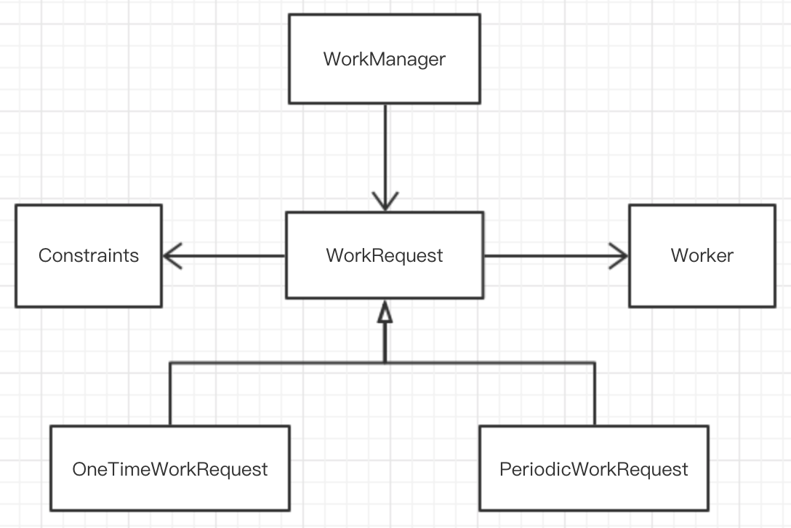

#### 0x00 简述

WorkManager 是 Android Jetpack中的一部分，它主要是封装了 Android 后台任务的调度逻辑。在前文《Android后台任务处理指南》一文中知道，WorkManager 是高级 API，它实际是封装了[`JobScheduler`](https://developer.android.com/reference/android/app/job/JobScheduler.html), [Firebase JobDispatcher](https://github.com/firebase/firebase-jobdispatcher-android#user-content-firebase-jobdispatcher-), 和 [`AlarmManager`](https://developer.android.com/reference/android/app/AlarmManager.html) 底层的使用，提供了简单且灵活易用的API，它有很多优势：

- 支持异步一次性或周期任务
- 支持网络、存储空间以及电量状态等约束
- 可使用链式的调用方式来执行任务，也包括并行任务处理
- 一个工作任务的执行结果可以作为下一个任务的输入
- 兼容API 14 以上
- 可以支持Google play services
- 支持LiveData

#### 0x01 理论篇——重要的类

WorkManager库中有一些非常重要的类，这些类帮助你构建后台执行的工作任务：

- `Worker`：这是一个抽象类，它表示一个工作任务，继承这个类实现`doWork()`方法，这里就是实现执行任务的主要逻辑。
- `WorkRequest`：表示一个工作任务请求，指定执行哪个`Work`，它还可以设置任务执行的约束条件。每一个`WorkRequest`都有一个自动生成的唯一ID。使用这个ID可以取消任务的执行，或者取得当前任务的执行状态。`WorkRequest`也是一个抽象类，使用的时候是框架库中提供的子类`OneTimeWorkRequest`和`PeriodicWorkRequest`类，分别代表**一次性任务和周期任务**
  - `WorkRequest.Builder`：这是一个创建工作任务请求的辅助工具类。它有两个具体的实现：`OneTimeWorkRequest.Builder`类和`PeriodicWorkRequest.Builder`类，可以分别创建相应的任务请求实例。
  - `Constraints`：它表示工作任务执行的约束条件。指的是在哪一些系统条件下（例如只有网络连接情况下），这个工作任务会被执行。同样地，创建`Constraints`也有`Builder`方法：`Constraints.Builder`。约束类是可以在使用`WorkRequest.Builder` 创建的时候进行传递给`WorkRequest`。
- `WorkManager`：工作任务管理器，它是用于管理工作任务的请求队列的类。通过它可以把一个`WorkRequest`加入到任务队列中，然后根据系统的资源和约束条件对工作任务进行调度。
- `WorkStatus`：工作状态类，它包含了工作任务当前的状态信息。`WorkManager` 为每一个`WorkRequest`都提供了`LiveData`对象，而`LiveData`对象又持有`WorkStatus`信息，因此通过`LiveData`可以监听到当前任务的状态信息，并且获取到任务结束后的执行结果。

通过上面的描述，可以简单的画出下面的关系图：



#### 0x02 实践篇——工作流

假设我们在开发一个图片相关的APP，这个应用需要期地压缩它存储的图片。我们使用`WorkManager`来实现这个需求。这种情况，我们不关心压缩任务什么时候开始，只要开启一个压缩任务，其他的就交给`WorkManager`了。

1. **定义Worker**

我们首先要定义一个`Worker`类，并重写`doWork()`方法，这里定义了如何执行任务的具体逻辑。例如在此例子中，`myCompress()`就是具体的执行任务的逻辑。

```kotlin
class CompressWorker(context : Context, params : WorkerParameters)
    : Worker(context, params) {

    override fun doWork(): Result {
        // Do the work here--in this case, compress the stored images.
        // In this example no parameters are passed; the task is
        // assumed to be "compress the whole library."
        myCompress()

        // Indicate success or failure with your return value:
        return Result.SUCCESS

        // (Returning RETRY tells WorkManager to try this task again
        // later; FAILURE says not to try again.)
    }
}
```

`doWork()` 执行后还可以返回执行的结果：`Result.SUCCESS`、`Result.FAILURE`和`Result.RETRY` 分别表示**成功**、**失败**、**重试**。

2. **创建WorkRequest**

使用`WorkRequest`的子类，根据具体业务创建对应的请求实例。例如本例中，使用一次性任务来构建请求。然后把任务请求加入到`WorkManager`管理的队列中。

```kotlin
val compressionWork = OneTimeWorkRequest.Builder<CompressWorker>().build()
WorkManager.getInstance().enqueue(compressionWork)
```

这样这个任务就交给`WorkManager`了，任务管理者根据当前系统情况（是否充电、网络状态等等）对任务进行调度。如果没有给`WorkRequest`指定约束条件，那么这个任务会马上执行。如果需要得到这个任务的状态，可以通过`LiveData<WorkStatus>`来监听。

```kotlin
WorkManager.getInstance().getStatusById(compressionWork.id)
                .observe(lifecycleOwner, Observer { workStatus ->
                    // Do something with the status
                    if (workStatus != null && workStatus.state.isFinished) {
                        // ...
                    }
                })
```

3. **任务约束**

可以给一个任务指定约束条件。例如，可以在设备空闲的时候、或者充电的时候执行任务。这种情况，可以使用`Constraints.Builder`来创建一个约束条件实例，然后传递到`WorkRequest`中。

```kotlin
// Create a Constraints object that defines when the task should run
val myConstraints = Constraints.Builder()
        .setRequiresDeviceIdle(true)
        .setRequiresCharging(true)
        // Many other constraints are available, see the
        // Constraints.Builder reference
        .build()

// ...then create a OneTimeWorkRequest that uses those constraints
val compressionWork = OneTimeWorkRequestBuilder<CompressWorker>()
        .setConstraints(myConstraints)
        .build()
```

最后，还是调用`WorkManager`的`enqueue`方法将`WorkRequest`加入队列。这时候，`WorkManager`在执行任务的时候就会考虑约束条件的情况。

4. **取消任务**

取消任务需要一个任务ID，可以通过`WorkRequest`来获取。然后调用`WorkManager`的`cancelWorkById`方法来取消任务的执行。

```kotlin
val compressionWorkId:UUID = compressionWork.getId()
WorkManager.getInstance().cancelWorkById(compressionWorkId)
```

5. **给任务设置Tag**

可以给一组任务设置一个Tag。在创建 `WorkRequest` 的时候，可以执行给它指定一个Tag；而另一个任务请求也可以设置相同的Tag。

```kotlin
val cacheCleanupTask =
        OneTimeWorkRequest.Builder<MyCacheCleanupWorker>()
    .addTag("one-tag")
    .build()
val loadImageTask = OneTimeWorkRequest.Builder<MyImageLoadWorker>()
    .addTag("one-tag")
    .build()
```

`WorkManager`提供了很多有用的API操作这些相同Tag的任务。例如，`WorkManager.cancelAllWorkByTag()` 可以取消具有相同Tag的一组任务；还可以通过`WorkManager.getStatusesByTag()`获取一组任务的状态列表。

6. **周期任务**

有些业务场景是需要重复执行一个任务的。例如，在一个图片应用中，可能会有一个定期检查需要压缩图片的任务。这时候可使用到 `PeriodicWorkRequest.Builder` 来创建一个周期任务。跟一次性任务一样，通过`WorkManager.enqueue()` 方法加入到工作任务队列中。

```kotlin
val photoCheckBuilder =
        PeriodicWorkRequest.Builder<PhotoCheckWorker>(12, TimeUnit.HOURS)
// ...if you want, you can apply constraints to the builder here...

// Create the actual work object:
val photoCheckWork = photoCheckBuilder.build()
// Then enqueue the recurring task:
WorkManager.getInstance().enqueue(photoCheckWork)
```

接下来的事情就交给 `WorkManager` 了。

#### 0x03 引用

https://developer.android.com/topic/libraries/architecture/workmanager/basics