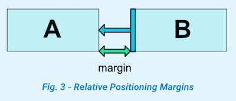
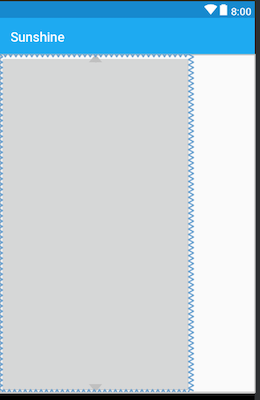
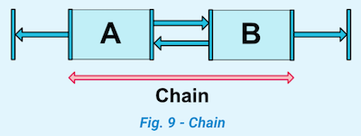
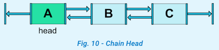
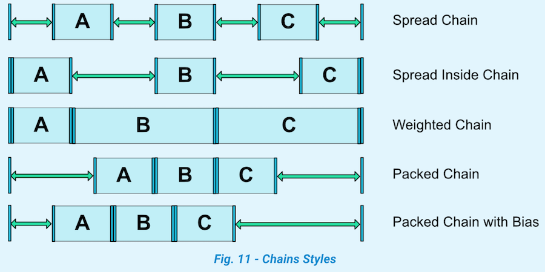

`ConstraintLayout` 相对于`RelativeLayout`来说性能更好，布局上也更加灵活。在最新的Google Android开发文档中是推荐使用`ConstraintLayout`的，下面来看看具体用法。

#### 0x00 相对位置(Relative positioning)

这个比较简单，看图解释，假设控件B要放在控件A的右侧，可以使用`layout_constraintLeft_toRightOf`属性。


```xml
<Button android:id="@+id/buttonA" ... />
<Button android:id="@+id/buttonB" ...
     app:layout_constraintLeft_toRightOf="@+id/buttonA" />
```

看图2可以了解控件约束属性代表的含义。


类似相对位置的约束属性有：

- `layout_constraintLeft_toLeftOf`
- `layout_constraintLeft_toRightOf`
- `layout_constraintRight_toLeftOf`
- `layout_constraintRight_toRightOf`
- `layout_constraintTop_toTopOf`
- `layout_constraintTop_toBottomOf`
- `layout_constraintBottom_toTopOf`
- `layout_constraintBottom_toBottomOf`
- `layout_constraintBaseline_toBaselineOf`
- `layout_constraintStart_toEndOf`
- `layout_constraintStart_toStartOf`
- `layout_constraintEnd_toStartOf`
- `layout_constraintEnd_toEndOf`

#### 0x01 外边距(Margins)

这个属性也好理解，看图3



可以通过以下属性设置一个控件相对另一个控件的外边距：

- `android:layout_marginStart`
- `android:layout_marginEnd`
- `android:layout_marginLeft`
- `android:layout_marginTop`
- `android:layout_marginRight`
- `android:layout_marginBottom`

属性值必须是大于或者等于0。

接一下看一个`RelativeLayout` 没有的属性：

#### 0x02 Margins when connected to a GONE widget

当一个相对的控件隐藏时，`ConstraintLayout`也可以设置一个不同的边距：

- `layout_goneMarginStart`
- `layout_goneMarginEnd`
- `layout_goneMarginLeft`
- `layout_goneMarginTop`
- `layout_goneMarginRight`
- `layout_goneMarginBottom`

具体的栗子下面会讲到。

#### 0x03 Centering positioning and bias

居中以及设置偏差


```xml
<android.support.constraint.ConstraintLayout ...>
	<Button android:id="@+id/button" ...
		app:layout_constraintLeft_toLeftOf="parent"
		app:layout_constraintRight_toRightOf="parent"/>                                     
</android.support.constraint.ConstraintLayout>
```

还可以设置bias属性，表示子控件相对父控件的位置倾向，可以使用属性：

- `layout_constraintHorizontal_bias`
- `layout_constraintVertical_bias`


假设设置控件A相对父控件横向偏差是30%：

```xml
<android.support.constraint.ConstraintLayout ...>
             <Button android:id="@+id/button" ...
                 app:layout_constraintHorizontal_bias="0.3"
                 app:layout_constraintLeft_toLeftOf="parent"
                 app:layout_constraintRight_toRightOf="parent"/>
</android.support.constraint.ConstraintLayout>
```

#### 0x04 弧形定位(Circular positioning) 

这个属性是在1.1版本添加的。


可以使用属性有：

- `layout_constraintCircle` : 相对控件的id
- `layout_constraintCircleRadius` : 相对控件中心的距离，也就是圆的半径
- `layout_constraintCircleAngle` : 相对夹角 (从 0 ~ 360度)

例如，图6代码示例

```xml
<Button android:id="@+id/buttonA" ... />
<Button android:id="@+id/buttonB" ...
	app:layout_constraintCircle="@+id/buttonA"
	app:layout_constraintCircleRadius="100dp"
	app:layout_constraintCircleAngle="45" />
```

#### 0x05 Visibility behavior


一般情况下，设置`GONE`属性后，控件就不会出现在布局中了，B控件对A控件的margin属性也就没有作用了。

但是`ConstraintLayout` 能对已经设置`GONE`属性的控件进行特殊处理。当A控件设置`GONE`之后，A控件相当于变成了一个点，**B控件相对于对A的约束仍然是起作用的**。图7的代码示例，A控件设置成了`GONE`,当B控件的`margin`属性还是有作用的。

```xml
<android.support.constraint.ConstraintLayout ...>
    <Button
        android:id="@+id/buttonA"
        android:layout_width="wrap_content"
        android:layout_height="wrap_content"
        android:text="button A"
        android:visibility="gone"
        app:layout_constraintLeft_toLeftOf="parent" />
	<!--当A控件设置Gone之后，B控件的margin属性是起作用的，即左边距还是30dp-->
    <Button
        android:id="@+id/buttonB"
        android:layout_width="wrap_content"
        android:layout_height="wrap_content"
        android:layout_margin="30dp"
        android:text="button B"
        app:layout_constraintLeft_toRightOf="@+id/buttonA" />
</android.support.constraint.ConstraintLayout>
```

然而有时候，**B控件是不希望相对于隐藏控件的属性还起作用**。这时候可以用到上面**0x02**提到的`goneMargin`属性。

```xml
<android.support.constraint.ConstraintLayout ...>

    <Button
        android:id="@+id/buttonA"
        android:layout_width="wrap_content"
        android:layout_height="wrap_content"
        android:text="button A"
        android:visibility="gone"
        app:layout_constraintLeft_toLeftOf="parent" />
	<!--当A控件设置Gone之后，希望B控件的左边距为0dp，那么可以设置layout_goneMarginLeft属性-->
    <Button
        android:id="@+id/buttonB"
        android:layout_width="wrap_content"
        android:layout_height="wrap_content"
        android:layout_margin="30dp"
        android:text="button B"
        app:layout_goneMarginLeft="0dp"
        app:layout_constraintLeft_toRightOf="@+id/buttonA" />
</android.support.constraint.ConstraintLayout>
```

#### 0x06 尺寸约束(Dimensions constraints)

**设置最小或最大尺寸**

可以使用以下属性：

- `android:minWidth` 
- `android:minHeight` 
- `android:maxWidth` 
- `android:maxHeight` 

当`ConstraintLayout`宽高设置为`wrap_content`时，以上属性可以起作用。

**设置百分比布局**

当`ConstraintLayout` 子布局的宽或高设置为0dp时，可以对宽或高设置百分比，例如设置一个按钮的宽是屏幕宽度的30%，那么可以这样处理：

```xml
<android.support.constraint.ConstraintLayout ...>
    <!--按钮width属性设置为0dp,然后需要指定layout_constraintWidth_default，以及layout_constraintWidth_percent两个属性-->
    <Button
        android:id="@+id/buttonB"
        android:layout_width="0dp"
        android:layout_height="wrap_content"
        android:text="button B"
        app:layout_constraintLeft_toLeftOf="parent"
        app:layout_constraintWidth_default="percent"
        app:layout_constraintWidth_percent="0.3" />
</android.support.constraint.ConstraintLayout>
```

设置宽度百分比布局：

1. `layout_width`或者`layout_height` 设置为0dp
2. 设置`layout_constraintWidth_default="percent"`或者`layout_constraintHeight_default="percent"`
3. 通过`layout_constraintWidth_percent`或者`layout_constraintHeight_percent`指定百分比

**设置宽高比例**

当`layout_width`或者`layout_height`设置为0dp时，还可以通过`layout_constraintDimensionRatio`设置宽高比例。该比例表示`width:height`的值。

```xml
<Button 
	android:layout_width="wrap_content"
	android:layout_height="0dp"
	app:layout_constraintDimensionRatio="1:1" />
```

当`layout_width`与`layout_height`都设置为0dp时，通过`app:layout_constraintDimensionRatio` 指定宽高的比例。这时控件的宽高将按照该比例相对于父布局的大小设置宽高。

```xml
<android.support.constraint.ConstraintLayout ...>
    <Button
        android:layout_width="0dp"
        android:layout_height="0dp"
        app:layout_constraintBottom_toBottomOf="parent"
        app:layout_constraintDimensionRatio="h,16:9"
        app:layout_constraintTop_toTopOf="parent" />
</android.support.constraint.ConstraintLayout>
```

`h,16:9`的含义是`h:w=16:9` 也可设置`w,9:16`效果是一样的。



#### 0x07 Chains

在横轴或或者数轴上的控件相互约束时，可以组成一个**链式约束**。



图9中，A控件与B控件相互约束，这就是一个简单的链式约束。

**链头**



**Chain Style**

可以通过`layout_constraintHorizontal_chainStyle`或`layout_constraintVertical_chainStyle`设置链式控件的样式。这个属性有点像`LinearLayout`中的`weight` 属性平分布局。

- `CHAIN_SPREAD` 
- Weighted chain 
- `CHAIN_SPREAD_INSIDE` 
- `CHAIN_PACKED` 



**设置权重**

- `layout_constraintHorizontal_weight`
- `layout_constraintVertical_weight`

#### 0x08 引用

https://developer.android.com/reference/android/support/constraint/ConstraintLayout