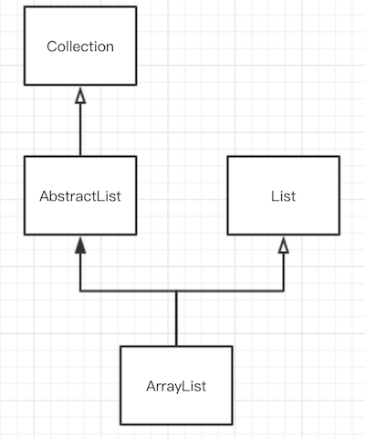

#### 0x00 描述

`ArrayList` 可以说是 `Java` 程序猿最为常用的一种数据结构了。`ArrayList` 是通过数组实现的，容量可以自增的线性表。而数组的优点是计算机可以通过下标计算访问地址，所以访问元素的速度是很快的，时间复杂度为O(1)；但数组并不擅长插入和删除操作，这些操作的时间复杂度是O(n)。因此 `ArrayList` 继承了数组这些特点。

##### 继承关系

`ArrayList` 继承于 `AbstractList` 并实现了 `List` 、`RandomAccess`、`Cloneable` 和 `Serializable` 接口。

而 `AbstractList` 是继承于 `Collection` 接口。因此简单的关系图可以表达为



##### 重要属性

- `elementData` 这个是存放数据的 `Object` 数组
- `size` 记录当前数组元素的个数
- `modCount` 用于记录修改次数，例如增加、删除等操作时此变量会自增。当这个变量异常变化时，会抛出 `ConcurrentModificationException` 

##### 构造方法

```java
public ArrayList() {
	this.elementData = DEFAULTCAPACITY_EMPTY_ELEMENTDATA;
}
```

默认构造函数初始化 `elementData` 大小为10 空数组。

```java
public ArrayList(int initialCapacity) {
    if (initialCapacity > 0) {
        this.elementData = new Object[initialCapacity];
    } else if (initialCapacity == 0) {
        this.elementData = EMPTY_ELEMENTDATA;
    } else {
        throw new IllegalArgumentException("Illegal Capacity: "+                                      initialCapacity);
    }
}
```

此方法通过一个 `initialCapacity` 变量对数组进行初始化。当传入的 `initialCapacity` 大于0时，elementData就是初始化为大小为 `initialCapacity` 的空数组；否则就是初始化为大小为0的空数组。

```java
public ArrayList(Collection<? extends E> c) {
	elementData = c.toArray();
   	if ((size = elementData.length) != 0) {
		// c.toArray might (incorrectly) not return Object[] (see 6260652)
		if (elementData.getClass() != Object[].class)
			elementData = Arrays.copyOf(elementData, size, Object[].class);
	} else {
		// replace with empty array.
		this.elementData = EMPTY_ELEMENTDATA;
	}
}
```

这个方法是通过一个 `Collection` 对象进行初始化的。这里调用了 `Arrays.copyOf` 方法将数组元素进行拷贝，并返回一个新的数组。后文会详细解析这个方法。

#### 0x01 常用方法

##### add(E e)

给 `ArrayList` 添加一个元素

```java
public boolean add(E e) {
	ensureCapacityInternal(size + 1);  // Increments modCount!!
	elementData[size++] = e;
	return true;
}
```

添加元素之前，调用了 `ensureCapacityInternal` 方法，确保 `elementData` 数组有足够的空间。然后数组后面添加一个元素，并把元素个数 `size` 的值加1。

```java
private void ensureCapacityInternal(int minCapacity) {
	if (elementData == DEFAULTCAPACITY_EMPTY_ELEMENTDATA) {
		minCapacity = Math.max(DEFAULT_CAPACITY, minCapacity);
	}

	ensureExplicitCapacity(minCapacity);
}
```

在 `ensureCapacityInternal` 中先判断 `elementData` 是否为空数组，如果是，则取 `DEFAULT_CAPACITY` 与 `minCapacity` 的最大值作为数组的最小容量。

然后再执行 `ensureExplicitCapacity` 方法。

```java
private void ensureExplicitCapacity(int minCapacity) {
	modCount++;

	// overflow-conscious code
	if (minCapacity - elementData.length > 0)
		grow(minCapacity);
}
```

先把 `modCount` 加1，表示对该列表进行了一次操作。

`minCapacity` 表示目前需要的容量大小。如果它大于目前 `elementData` 的容量大小，那么就会执行 `grow` 方法增加数组容量。

```java
private void grow(int minCapacity) {
	// overflow-conscious code
	int oldCapacity = elementData.length;
	int newCapacity = oldCapacity + (oldCapacity >> 1);//右移1位操作相当于除2
	if (newCapacity - minCapacity < 0)
		newCapacity = minCapacity;
	if (newCapacity - MAX_ARRAY_SIZE > 0)
		newCapacity = hugeCapacity(minCapacity);
	// minCapacity is usually close to size, so this is a win:
	elementData = Arrays.copyOf(elementData, newCapacity);
}
```

该方法的逻辑是

1. 先获取到 `newCapacity` ，它是原来容量大小的1.5倍
2. 如果需要的容量大小 `minCapacity` 大于原来容量的1.5，那么 `newCapacity` 就取 `minCapacity`
3. 如果 `newCapacity` 还大于最大的容量，那么就执行 `hugeCapacity` 来计算得到容量大小
4. 最后调用 `Arrays.copyOf` 方法把 `elementData` 拷贝到一个新的数组中，这个新数组大小为 `newCapacity`

```java
private static int hugeCapacity(int minCapacity) {
	if (minCapacity < 0) // overflow
		throw new OutOfMemoryError();
	return (minCapacity > MAX_ARRAY_SIZE) ? Integer.MAX_VALUE : MAX_ARRAY_SIZE;
}
```

因此在调用 `add` 方法时，如果**当前数组 `elementData` 的容量不够时，就会调用扩容的 `grow` 方法，把数组扩大为原来的1.5倍的大小。**

##### add(int index, E element)

在指定的 `index` 位置上添加一个元素

```java
public void add(int index, E element) {
	if (index > size || index < 0)
		throw new IndexOutOfBoundsException(outOfBoundsMsg(index));

	ensureCapacityInternal(size + 1);  // Increments modCount!!
	System.arraycopy(elementData, index, elementData, index + 1, size - index);
	elementData[index] = element;
	size++;
}
```

通过上面的 `add` 方法的走读，这个方法就很好理解了。

先对 `index` 参数的有效性进行判断；

然后执行 `ensureCapacityInternal` 确保数组的容量大小是足够的，此时 `modCount` 也会自增；

再执行 `System.arraycopy` 方法把数组元素从 `index` 的位置后移1位；（`System.arraycopy` 函数后文还会讲到）

最后在 `index` 位置上赋值，并把 `size` 加 1。

##### addAll(Collection<? extends E> c)

```java
public boolean addAll(Collection<? extends E> c) {
	Object[] a = c.toArray();
	int numNew = a.length;
	ensureCapacityInternal(size + numNew);  // Increments modCount
	System.arraycopy(a, 0, elementData, size, numNew);
	size += numNew;
	return numNew != 0;
}
```

`addAll` 方法把一个 `Collection` 对象添加到列表中来。

它会先把 `Collection` 对象通过 `toArray` 方法转化为数组，然后再调用 `System.arraycopy` 进行数据的移动。

##### addAll(int index, Collection<? extends E> c)

```java
public boolean addAll(int index, Collection<? extends E> c) {
	if (index > size || index < 0)
		throw new IndexOutOfBoundsException(outOfBoundsMsg(index));

	Object[] a = c.toArray();
	int numNew = a.length;
	ensureCapacityInternal(size + numNew);  // Increments modCount

	int numMoved = size - index;
	if (numMoved > 0)
		System.arraycopy(elementData, index, elementData, index + numNew, numMoved);
	
    System.arraycopy(a, 0, elementData, index, numNew);
	size += numNew;
	return numNew != 0;
}
```

在 `index` 位置上添加一个列表

它与上面 `addAll` 方法的区别就是先从 `index` 开始移动 `numNew` 个位置，即空出 `numNew` 个位置。

然后再空出的 `numNew` 位置上添加元素。

##### remove(int index)

删除指定 `index` 位置上的元素

```java
public E remove(int index) {
	if (index >= size)
		throw new IndexOutOfBoundsException(outOfBoundsMsg(index));

	modCount++;
	E oldValue = (E) elementData[index];

	int numMoved = size - index - 1;
	if (numMoved > 0)
		System.arraycopy(elementData, index+1, elementData, index,
                             numMoved);
	elementData[--size] = null; // clear to let GC do its work

	return oldValue;
}
```

执行流程为

1. 检查 `index` 有效性，无效则抛出 `IndexOutOfBoundsException` 异常
2. `modCount` 自增
3. 通过 `index` 下标取出元素
4. 计算 `index` 后面需要移动的元素个数
5. 通过 `System.arraycopy` 将 `index` 后面的元素都往前移动1位
6. 最后把末尾元素置位 `null`，并把 `size` 的值减 1。

##### remove(Object o)

通过一个元素对象进行删除

```java
public boolean remove(Object o) {
	if (o == null) {
		for (int index = 0; index < size; index++)
			if (elementData[index] == null) {
				fastRemove(index);
				return true;
			}
	} else {
		for (int index = 0; index < size; index++)
			if (o.equals(elementData[index])) {
				fastRemove(index);
				return true;
			}
	}
	return false;
}
```

当传一个元素对象进行删除操作时，需要遍历数组，找到该元素在列表中的位置 `index`；

然后通过 `fastRemove` 方法进行删除。

```java
private void fastRemove(int index) {
	modCount++;
	int numMoved = size - index - 1;
	if (numMoved > 0)
		System.arraycopy(elementData, index+1, elementData, index, numMoved);
	elementData[--size] = null; // clear to let GC do its work
}
```

##### clear()

清空列表

```java
public void clear() {
	modCount++;

	// clear to let GC do its work
	for (int i = 0; i < size; i++)
		elementData[i] = null;

	size = 0;
}
```

##### subList(int fromIndex, int toIndex)

获取子列表

```java
public List<E> subList(int fromIndex, int toIndex) {
	subListRangeCheck(fromIndex, toIndex, size);
	return new SubList(this, 0, fromIndex, toIndex);
}

static void subListRangeCheck(int fromIndex, int toIndex, int size) {
	if (fromIndex < 0)
		throw new IndexOutOfBoundsException("fromIndex = " + fromIndex);
	if (toIndex > size)
		throw new IndexOutOfBoundsException("toIndex = " + toIndex);
	if (fromIndex > toIndex)
		throw new IllegalArgumentException("fromIndex(" + fromIndex +") > toIndex(" + toIndex + ")");
}
```

首先检查下标是否正确，然后构造一个 `SubList` 对象，这是一个内部类。

`SubList` 也是继承于 `AbstractList`。

```java
private class SubList extends AbstractList<E> implements RandomAccess {
        private final AbstractList<E> parent;
        private final int parentOffset;
        private final int offset;
        int size;

        SubList(AbstractList<E> parent,
                int offset, int fromIndex, int toIndex) {
            this.parent = parent;
            this.parentOffset = fromIndex;
            this.offset = offset + fromIndex;
            this.size = toIndex - fromIndex;
            this.modCount = ArrayList.this.modCount;
        }

        public E set(int index, E e) {
            if (index < 0 || index >= this.size)
                throw new IndexOutOfBoundsException(outOfBoundsMsg(index));
            if (ArrayList.this.modCount != this.modCount)
                throw new ConcurrentModificationException();
            E oldValue = (E) ArrayList.this.elementData[offset + index];
            ArrayList.this.elementData[offset + index] = e;
            return oldValue;
        }

        public E get(int index) {
            if (index < 0 || index >= this.size)
              throw new IndexOutOfBoundsException(outOfBoundsMsg(index));
            if (ArrayList.this.modCount != this.modCount)
                throw new ConcurrentModificationException();
            return (E) ArrayList.this.elementData[offset + index];
        }

        ...

        public void add(int index, E e) {
            if (index < 0 || index > this.size)
                throw new IndexOutOfBoundsException(outOfBoundsMsg(index));
            if (ArrayList.this.modCount != this.modCount)
                throw new ConcurrentModificationException();
            parent.add(parentOffset + index, e);
            this.modCount = parent.modCount;
            this.size++;
        }

        public E remove(int index) {
            if (index < 0 || index >= this.size)
                throw new IndexOutOfBoundsException(outOfBoundsMsg(index));
            if (ArrayList.this.modCount != this.modCount)
                throw new ConcurrentModificationException();
            E result = parent.remove(parentOffset + index);
            this.modCount = parent.modCount;
            this.size--;
            return result;
        }

        ...

        public boolean addAll(Collection<? extends E> c) {
            return addAll(this.size, c);
        }

        public boolean addAll(int index, Collection<? extends E> c) {
            if (index < 0 || index > this.size)
                throw new IndexOutOfBoundsException(outOfBoundsMsg(index));
            int cSize = c.size();
            if (cSize==0)
                return false;

            if (ArrayList.this.modCount != this.modCount)
                throw new ConcurrentModificationException();
            parent.addAll(parentOffset + index, c);
            this.modCount = parent.modCount;
            this.size += cSize;
            return true;
        }
    
        ...
    }
```

`SubList` 构造方法需要一个父列表。在获取、添加、删除元素的方法中实际上都是调用父列表中的方法。

不过这些操作的方法中会判断 `modCount` 的值是否已经变化，如果异常改变了，那么就会抛出 `ConcurrentModificationException` 异常。

##### forEach(Consumer<? super E> action)

遍历列表元素

```java
public void forEach(Consumer<? super E> action) {
	Objects.requireNonNull(action);
	final int expectedModCount = modCount;
	@SuppressWarnings("unchecked")
	final E[] elementData = (E[]) this.elementData;
	final int size = this.size;
	for (int i=0; modCount == expectedModCount && i < size; i++) {
		action.accept(elementData[i]);
	}
	// Android-note:
	// Iterator will not throw a CME if we add something while iterating over the *last* element
	// forEach will throw a CME in this case.
	if (modCount != expectedModCount) {
		throw new ConcurrentModificationException();
	}
}
```

同样地，此方法中如果 `modCount` 被异常修改了（例如在其他线程中执行了 `add` 方法）那么就会抛出 `ConcurrentModificationException` 异常。

##### iterator()

获取遍历器

```java
public Iterator<E> iterator() {
	return new Itr();
}
```

`Itr` 是一个内部类，实现了 `Iterator` 接口。

```java
private class Itr implements Iterator<E> {
	// Android-changed: Add "limit" field to detect end of iteration.
	// The "limit" of this iterator. This is the size of the list at the time the
	// iterator was created. Adding & removing elements will invalidate the iteration
	// anyway (and cause next() to throw) so saving this value will guarantee that the
	// value of hasNext() remains stable and won't flap between true and false when elements
	// are added and removed from the list.
	protected int limit = ArrayList.this.size;

	int cursor;       // index of next element to return
	int lastRet = -1; // index of last element returned; -1 if no such
	int expectedModCount = modCount;

	public boolean hasNext() {
		return cursor < limit;
	}

	@SuppressWarnings("unchecked")
	public E next() {
		if (modCount != expectedModCount)
			throw new ConcurrentModificationException();
		int i = cursor;
		if (i >= limit)
			throw new NoSuchElementException();
		Object[] elementData = ArrayList.this.elementData;
		if (i >= elementData.length)
			throw new ConcurrentModificationException();
		cursor = i + 1;
		return (E) elementData[lastRet = i];
	}
	public void remove() {
		if (lastRet < 0)
			throw new IllegalStateException();
		if (modCount != expectedModCount)
			throw new ConcurrentModificationException();

		try {
			ArrayList.this.remove(lastRet);
			cursor = lastRet;
			lastRet = -1;
			expectedModCount = modCount;
			limit--;
		} catch (IndexOutOfBoundsException ex) {
			throw new ConcurrentModificationException();
		}
	}

	...
}
```

该类中 `cursor` 属性记录了当前迭代的位置，每调用一次 `next` 方法都会加 1，`lastRet` 则记录了上一次的元素位置。

`remove` 方法则是通过调用外部类的 `remove` 方法来实现的。

以上两个方法中也需要注意 `ConcurrentModificationException` 异常的发生。

##### contains(Object o)

检测是否包含元素

```java
public boolean contains(Object o) {
	return indexOf(o) >= 0;
}

public int indexOf(Object o) {
	if (o == null) {
		for (int i = 0; i < size; i++)
			if (elementData[i]==null)
				return i;
	} else {
		for (int i = 0; i < size; i++)
			if (o.equals(elementData[i]))
				return i;
	}
	return -1;
}
```

可以看出要检测一个元素是否在列表中，是通过遍历来实现的。

##### System.arraycopy

```java
public static native void arraycopy(Object src,  int  srcPos, Object dest, int destPos,int length);
```

这是数组拷贝函数，是 `native` 函数，它经过虚拟机优化的，效率比较高。在 `ArrayList` 中移动元素就是通过这个方法。

##### Arrays.copyOf

```java
public static <T> T[] copyOf(T[] original, int newLength) {
	return (T[]) copyOf(original, newLength, original.getClass());
}

public static <T,U> T[] copyOf(U[] original, int newLength, Class<? extends T[]> newType) {
	@SuppressWarnings("unchecked")
	T[] copy = ((Object)newType == (Object)Object[].class) ? (T[]) new Object[newLength] : (T[]) Array.newInstance(newType.getComponentType(), newLength);
	System.arraycopy(original, 0, copy, 0, Math.min(original.length, newLength));
	return copy;
}
```

可以看出 `copyOf` 函数最终调用的是 `System.arraycopy` 方法。本文中 `grow` 方法就是调用 `copyOf` 来实现扩容的。

#### 0x02 总结

- `ArrayList` 是基于数组实现的线性表，它支持自动扩容，每次增加原来容量的1.5倍。
- 通过下标获取元素操作效率高，而删除和插入操作则需要移动元素，效率不高。
- `remove` 函数通过对象删除元素时需要遍历列表，而通过下标 `index` 删除元素比通过对象删除元素的效率要高。
- `containts` 与 `clear`方法需要遍历。
- `subList` 获取到子列表，对子列表的修改同样也会修改父列表。
- `ArrayList` 没有同步锁，在多线程操作时需要注意 `ConcurrentModificationException` 异常。
- 如果在同一线程中对 `ArrayList` 操作时引起 `modCount` 异常改变时，也要注意 `ConcurrentModificationException` ，这时候要检查代码逻辑问题。